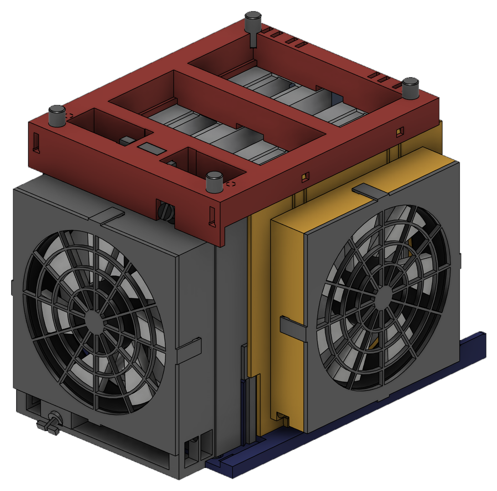
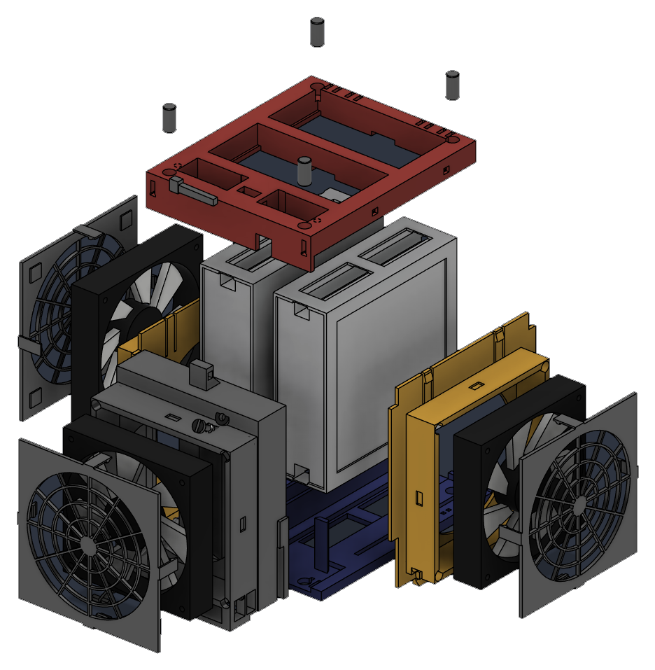
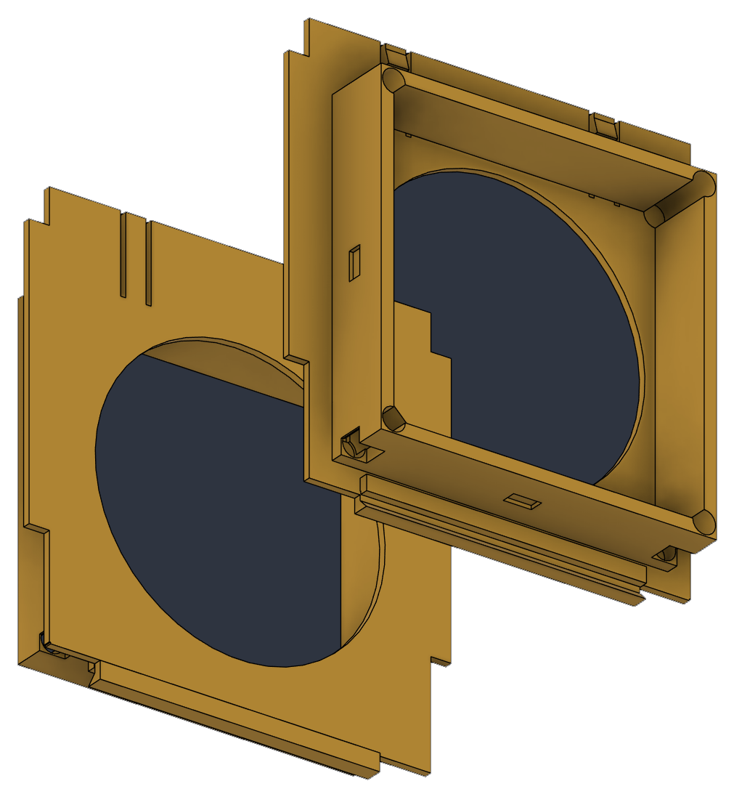

# DGX Spark Dual Cooler

A screwless, 3D-printed active-cooling cage that holds **two DGX Spark / ASUS Ascent GX10**
units on edge and drives three 120 mm fans through them.



There is not a single screw, heat-set insert or drop of glue in the assembly. Everything
slides into a dovetail, snaps into a latch, clips over a hook, or is locked by one printed
wedge key.

| | |
|---|---|
| Fans | 3 × 120 mm |
| Fasteners | none |
| Assembled size | 206 × 253 × 190 mm |
| Filament | ~570 g PETG at 20 % infill |
| Printed parts | 15 (10 unique) |
| Bed needed | 248 × 250 mm (largest part is 176 × 220 mm) |
| Supports | none, on any part |

## How it works



The two units stand on edge and are **mirrored** — one is flipped end-for-end so both filtered
bottom panels face outward into the side fans. Combined width is 50.5 + 19 + 50.5 = 120 mm,
exactly one fan frame.

- **Two side fans** blow inward through each unit's filtered bottom panel.
- **One front fan** pressurises a sealed plenum feeding both front intakes, plus a centre duct
  with two ram scoops that jets air down the 19 mm gap between the units.
- Everything exhausts out the rear, which is deliberately left clear for the port strips, the
  QSFP stacking cable and a future exhaust attachment.

A consequence of mirroring is that one unit's power button ends up near the top of its front
face and the other near the bottom — hence two different captive push-pins.

## Bill of materials

### Printed

| Part | Qty | Size mm | Print orientation | Support |
|---|---|---|---|---|
| `01-base-tray` | 1 | 176 × 220 × 46 | as exported | none |
| `02-front-plenum` | 1 | 139 × 180 × 66 | as exported | none¹ |
| `03-side-fan-arm` | 2 | 172 × 166 × 30 | as exported | none |
| `04-top-brace` | 1 | 156 × 190 × 30 | as exported | none |
| `05b-fan-grille-25mm` | 3 | 135 × 135 × 21 | as exported | none |
| `05-fan-grille-26mm` | 3 | 135 × 135 × 21 | as exported | none |
| `06-wedge-key` | 1 | 10 × 6 × 41 | as exported | none |
| `07-stacking-peg` | 4 | Ø10 × 20 | as exported | none |
| `08-button-pin-long` | 1 | 15 × 7 × 76 | as exported | none |
| `09-button-pin-short` | 1 | 10 × 10 × 46 | as exported | none |

Every STL and the 3MF are already **in their correct print orientation, sitting on Z = 0**.
Drop them in and slice — do not rotate.

> ¹ The plenum reports a large overhang area, but every one of those faces is a bridge. The
> widest unsupported span anywhere in the design is 12.8 mm, so no part needs support material.

**Print only one grille variant.** `05b` has 2.2 mm clamp pads for **25 mm** thick fans;
`05` has 1.2 mm pads for **26 mm** fans. The pads preload the fan against its sealing land, so
the wrong variant leaves the fan loose and buzzing.

### Bought

| Item | Qty | Notes |
|---|---|---|
| 120 mm fan | 3 | Tested with Thermalright TL-C12C (25 mm, 4-pin PWM, ASIN `B0BN19KSW2`, sold as a 3-pack) and NZXT F120 (26 mm). Any standard 120 × 120 fan with a 105 mm hole pitch fits. |
| Fan speed controller | 1 | Wathai 36 W, 110–240 V AC → 4–12 V DC 3 A with a 4-port splitter (ASIN `B0F4KG6MM1`). Voltage control, so all the heat stays in the external brick. Three fans draw ~0.6 A of 3 A. |
| Zip ties | ~8 | 2.5 × 100 mm, for the cable channels |

## Print settings

- **PETG.** Every latch, hook and pin leg is a printed spring; the strain figures assume
  E ≈ 2000 MPa. PLA will work but is more brittle at the flexures.
- **0.4 mm nozzle, 0.2 mm layers.**
- **4 perimeters minimum.** Thin walls halve the strength of every snap feature.
- **20 % infill** is plenty. Nothing is structural beyond the flexures.
- **Supports off** on every part.
- **Brim** on `08-button-pin-long` — it stands 76 mm tall on a 15 × 4 mm foot.

## Assembly

Full illustrated instructions: **[docs/assembly-guide.pdf](docs/assembly-guide.pdf)** (10 pages).

The short version:

1. Set down the base tray, front edge toward you.
2. Slide both side fan arms in **from the rear** along the 45° dovetails, ~150 mm.
3. Drop the front plenum onto the two dovetail posts.
4. Lower in the two units, mirrored. Connect the QSFP cable now.
5. Push the three fans into their collars from outside — side fans blow **in**, front fan blows
   **rearward**.
6. Clip the three grilles on: line up four hooks each, press until they click (~11 N).
7. Drop the top brace on — the arm latches snap near the end of travel — then tap the wedge key
   home through the bridge and the plenum tenon.
8. Press in the four stacking pegs and snap the two button pins into their tubes.

Teardown is the reverse: drive the key out, release both arm latches, lift the brace.

To swap a fan later, pry off that grille only. Nothing else has to come apart.

## Cable routing



All three fan leads run inside the cage and exit together at the rear. Each fan pocket has all
four corners relieved, so whichever corner the lead exits it has a channel; it drops through a
floor exit into the tunnel between the tray ear and the arm collar, then runs rearward through a
gland and out the back of the tray. The front fan's lead exits a side window in the plenum skirt
and joins the same tunnel.

The run sits entirely outboard of the exhaust footprint and below the port strip, so nothing is
in the hot stream and nothing crosses the rear ports.

**If you add your own bracket to the rear ears, keep it under 17 mm tall** — the arm collar
sweeps that band during assembly, and anything taller makes the arms impossible to fit or remove.

## Files

```
cad/    dgx-spark-cooling-cage.f3d     Fusion source, fully parametric
        dgx-spark-cooling-cage.step    STEP AP214, for any other CAD
print/  dgx-spark-cooling-cage.3mf     all parts, grouped by print plate
        stl/*.stl                      one file per part, print-oriented
docs/   assembly-guide.pdf             10-page illustrated guide
        design-notes.md                engineering rationale and verification
images/                                renders used above
```

The 3MF groups parts into eleven plates. Standard 3MF has no plate concept, so slicers will show
all objects at once laid out in a grid — use "arrange all" or assign plates by hand. The intended
grouping is in `design-notes.md`.


## License

Models (`cad/`, `print/`, `images/`): **CC BY 4.0** — see
[`LICENSE-CC-BY-4.0.txt`](LICENSE-CC-BY-4.0.txt).
Documentation and code: **Apache-2.0**, per the repository root.
